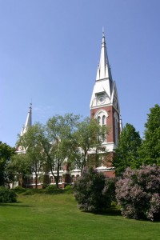

Mikkelinpäivän pyhäseudun, 1-2.10.2011, KOL:n valtakunnallisille Kulttuuri- ja hengellisille päiville!

Me Pohjois-Karjalan Sotaorvot odotamme innolla ainakin 600 vierasta Joensuuhun, vuoden tärkeimpään yhteiseen juhlaamme. Tiiviit valmistelut ovat olleet käynnissä jo pitkälti toista vuotta ja ohjelma pääpiirteissään valmiina! Haluamme antaa Pohjois-Karjalasta elinvoimaisen ja kulttuurisesti ja hengellisesti vireän, aidon karjalaisen kuvan, jossa ilot ja surut limittyvät elämänmakuisesti yhdeksi kokonaisuudeksi. Täällä eletään hyvin läheisessä rinnakkaiselossa luterilaisten ja ortodoksien kesken ja siksi myös ortodoksisuus on juhlaviikonlopussa vahvasti mukana. Lauantaina 1.10. Joensuun seurakuntayhtymä tarjoaa Joensuun seurakuntakeskuksessa, Kirkkokatu 28, ilmoittautumisen yhteydessä tulokahvit ja lähtökahveista vastaavat Pohjois-Karjalan Osuuspankit Karelian Marttojen käytännön avulla. Lauantain ohjelmassa on kiertoajelu Joensuussa, jossa käymme mm. ainutlaatuisella Bunkkerimuseolla, Ortodoksisessa Kulttuurikeskuksessa ja Utran pystyhirsikirkossa. Ilta päättyy Karjalaisen kansan messuun Joensuun kirkossa, jossa messun säveltäjä ja sanoittaja, Pielisensuun kirkkoherra Tapani Nuutinen palvelee yhdessä nuorekkaan Nardus-kuoron ja sen johtajan, kanttori Tiina Korhosen kanssa.

Sunnuntain juhlamessussa Joensuun kirkossa saarnaa Sortavalassa syntynyt emerituspiispa Matti Sihvonen. Ruokailu on Kontiorannan varuskunnassa, Pohjois-Karjalan Prikaatin muonituskeskuksessa, joka sijaitsee n.20 km:n päässä kaupungista. Sieltä kiirehdimme klo 14 alkavaan, n. kaksi tuntia kestävään pääjuhlaan, joka on Carelia-salissa, Joensuun upeimmassa juhlapaikassa. Carelia-sali on aivan keskustan tuntumassa, Itä-Suomen Yliopiston ytimessä, jossa mm. Joensuun Kaupunginorkesterin konsertit pidetään. Osoite on: Yliopistonkatu 2. Karjalan sotilassoittokunta, ja sen solistina monissa konserteissa laulanut nuori basso, oopperalaulajana jo uraansa aloittanut Matti Turunen, ovat juhlassa vahvasti mukana. Ortodoksisen Mieskuoron laulamat ”Jäähyväiset Valamolle” ja Finlandia eivät jättäne ketään koskettamatta. Nuorta nousevaa polvea edustavat Niinivaaran musiikkiluokat opettajansa, sotaorvon tyttären, Minna Mäkisen johtamina, samoin Motoran lasten ja nuorten iloiset tanhut tuovat tuulahduksen tulevaisuuden uskosta. Markku Pölösen Karjalan kunnailla-TV-sarjasta tutuksi tullut, rakastettavaa ortodoksista ”isä Antonia” esittävä Hannu Virolainen on juhlamme lausuja - ja draaman ”Sotilaan tarina” - esittää sotaorvon tytär, draamalehtori Riitta-Mari Punkki-Heikkinen. Ja tärkein viimeisenä: juhlapuheen pitää Itä-Suomen Läänin maaherran työtä jatkava, ylijohtaja Elli Aaltonen. Itsestään selvästi KOL: n puheenjohtaja Mauri Niskakoski ja varapuheenjohtaja Mikko Virrankoski sanovat painavan sanansa. Kunniamerkkien luovutus ja tervehdykset kuuluvat myös aina pääjuhlan ohjelmaan!

Juhlien yhteydessä julkaistaan Pohjois-Karjalan sotaorvoista kertova kirja ”Vaiettu suru”, jota voi ostaa myös paikan päältä. Vietämme samalla yhdistyksemme 10-vuotisjuhlia näin arvokkaissa merkeissä!

Panethan juhlien päivämäärän jo nyt allakkaasi ja teet päätöksen lähteä syksyllä Pohjois-Karjalaan! Tarkemmat tiedot ohjelmasta ja majapaikoista ym. ovat aikanaan Huoltoviestissä. Seuraa myös kotisivujemme infoa!

Odotamme Sinua!

Pohjois-Karjalan Sotaorvot ry:n hallituksen, ohjelmatoimikunnan ja 360 jäsenemme puolesta

Aune-Inkeri Keijonen, puheenjohtaja

Kuoringantie 6 B 83430 Käsämä

p. 045 1111065

aune-inkeri.keijonen@pp.inet.fi
