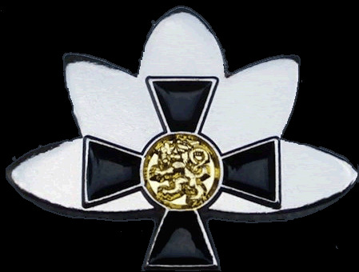

<figure class=""></figure>

Pohjois-Karjalan Sotaorvot ry on perustettu Puolustusvoimien lippujuhlan päivänä 4.6.2001 Joensuussa. Yhdistys on
valtakunnallisen Kaatuneitten Omaisten Liiton jäsenyhdistys, jonka toimialueena on Pohjois-
Karjalan alue. Jäsenkunnan muodostavat sotaorvot, muut kaatuneitten omaiset (esim. kaatuneen
sisarukset) ja kannatusjäsenet. Sotaorpojen keski-ikä on jo 85 vuotta.

Yhdistys toimii jäsenistönsä hyväksi järjestämällä hyvinvointia edistävää ryhmätoimintaa,
kulttuurielämyksiä, vertaistapaamisia esim. lounaan merkeissä ja suositun joulujuhlan.

Yhdistys vaalii Suomen sodissa 1939–45 kaatuneiden ja sodan olosuhteissa henkensä
menettäneiden muistoa kaatuneitten muistopäivän ja itsenäisyyspäivän juhlallisuuksin. Isänpäivän
muistohetkestä sankaripatsaalla on tullut jo perinne.

Pohjois-Karjalan Sotaorvot ry on myös Sotien 1939–1945 Pohjois-Karjalan Perinneyhdistyksen
jäsen. Veteraanien ja koko sotasukupolven perinteen vaaliminen yhdessä koetaan erittäin
tärkeäksi, vaikka yhdistys jatkaakin vielä omaa toimintaansa.

Yhteistyössä on voimaa! <a href="{{ '/tiedotteet/' | url }}">Ajankohtaisista tiedotteista</a> löytyy tarkempaa meidän tapahtumista.
